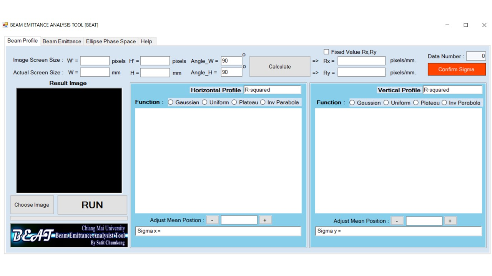
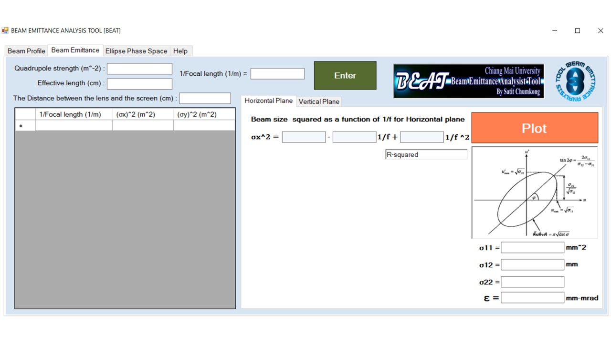
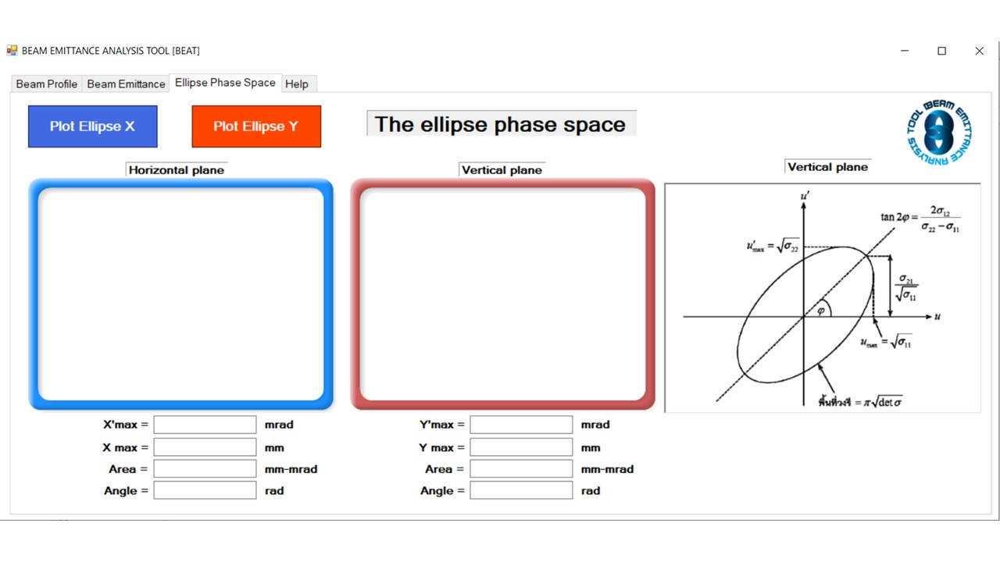

# The Beam Emittance Analysis Tool (BEAT)

> A comprehensive software solution for measuring and analyzing the transverse properties of electron beams, developed for the Plasma and Beam Physics Research Facility at Chiang Mai University.

---

## 📖 Table of Contents
- [Overview](#-overview)
- [Key Features](#-key-features)
- [Methodology](#-methodology)
- [Screenshots](#-screenshots)
- [System Requirements](#-system-requirements)
- [Publications](#-publications)
- [Credits & Developer](#-credits--developer)
- [Acknowledgments](#-acknowledgments)

---

## 🔭 Overview

**BEAT** is a specialized analysis program designed to study particle beam properties, which are critical for the advancement of particle accelerator technology. The software focuses on the measurement and analysis of the **transverse properties of electron beams** generated from a linear accelerator.

The tool processes beam images captured from fluorescent screens via CCD cameras to determine essential parameters such as:
* Beam Position
* Beam Size & Shape
* Beam Profile
* Transverse Emittance (via Quadrupole Scan)

---

## 🚀 Key Features

* **Advanced Image Processing:** Automatically analyzes electron beam images recorded when the beam hits a fluorescent screen to determine transverse size and profile.
* **Quadrupole Scan Integration:** Features a dedicated module for emittance analysis using the quadrupole scan technique, calculating beam sizes across varying focal lengths.
* **Phase Space Reconstruction:** Generates and visualizes the **Ellipse Phase Space**, providing a powerful description of the beam location and distribution.
* **Multiple Fitting Algorithms:** Supports 6 different analysis algorithms, including standard Gaussian distribution fitting and 2nd-order polynomial fitting for accurate emittance extraction.
* **User-Friendly Interface:** Developed with Microsoft Visual Studio 2013 to provide a convenient GUI for researchers.

---

## 🔬 Methodology

The core functionality of BEAT relies on the **Quadrupole Scan Technique**. The principle involves measuring the electron beam size as a function of the quadrupole field strength.

1.  **Data Acquisition:** Beam images are captured at various quadrupole settings.
2.  **Profile Analysis:** The software plots the intensity distribution and fits curves (e.g., Gaussian) to extract beam width ($\sigma$).
3.  **Emittance Calculation:** Using the transfer matrix and the measured beam sizes, the software calculates the geometrical emittance and constructs the phase ellipse.

---

## 📸 Screenshots

### User Interface & Profile Analysis

*The main interface displaying the beam spot and transverse intensity profiles.*

### Emittance Measurement & Phase Space

*Emittance measurement chart and phase space ellipse reconstruction.*

### Data Fitting Results

*Detailed view of the 2nd-order polynomial fitting for beam size data.*

---

## 💻 System Requirements

* **Operating System:** Windows 7 / 8 / 10
* **Framework:** .NET Framework (version compatible with VS2013)
* **Development Environment:** Microsoft Visual Studio 2013
* **Hardware:** Setup requires connection to an image capture card for live data or pre-recorded image files for offline analysis.

---

## 📝 Publications

This software has been featured in the following research:

1.  *Development of Analysis Program for Beam Transverse Profile and Emittance Measurements*
2.  *RF power commissioning and an electron beam diagnostic station for a new RF-gun at Chiang Mai University* (Energy Procedia, 2016)

---

## 👨‍💻 Credits & Developer

**Developer:**
**Mr.Satit Chumkong (Old Lastname) => Mr.Satit Siriwach (New Lastname)**

* **Affiliation:** Plasma and Beam Physics Research Facility (PBP), Faculty of Science, Chiang Mai University.
* **Role:** Software Design, Algorithm Implementation, and UI Development.

---

## 🤝 Acknowledgments

This work was supported by the **CMU Junior Research Fellowship Program** and the **Department of Physics and Materials Science, Faculty of Science, Chiang Mai University**. Special thanks to the advisory team and colleagues at the PBP facility.

---
*© Copyright 2015-2026 Satit Siriwach. All Rights Reserved.*
